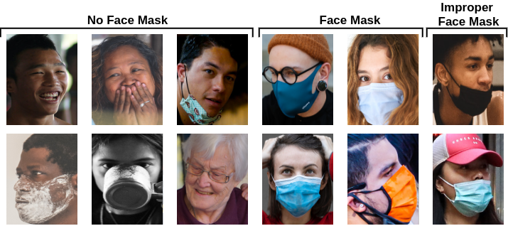
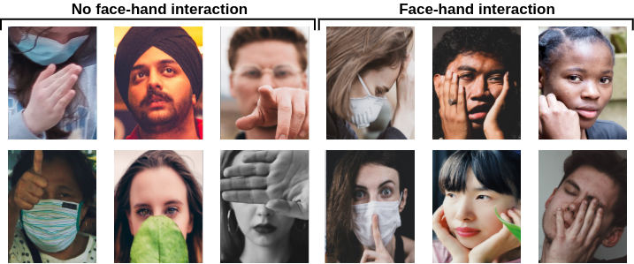

# COVID-19-Preventions-Control-System and Unconstrained Face-mask and Face-hand Datasets #

This is the GitHub repository of our work on the COVID-19 preventions control system to avoid transmission of the disease. Recently, The COVID-19 pandemic has affected the world since the beginning of 2020 and it still continues to affect our daily life. In this work, we investigated the most crucial COVID-19 preventions that are wearing a proper face mask, avoid touching the face with unsterilized hands, and keeping the social distance from others. For this purpose, we proposed a comprehensive prevention control system using deep CNN models. In proposed system, we trained face mask detection and face-hand interaction detection models using well-known deep CNN models. Further, we proposed an estimated geometrics-based distance controlling algorithm. 

In the purpose of this study, we collected and annotated two novel datasets. The first dataset which is named as Interactive Systems Labs Unconstrained Face Mask Dataset (ISL-UFMD), contains 20891* face images. The second dataset which is named as Interactive Systems Labs Unconstrained Face Hand Dataset (ISL-UFHD), contains 30056* face images.   The datasets were collected from the Internet. Each source and the related license is explicitly mentioned under the Licence Agreement section. <!--Information about each image is also explained in detail in ixml files.-->

Only the portions of datasets that available for free use only for research purposes are published directly by the download link. You have to obtain by yourself the other remaining portions that are not allowed to redistribute. The related information about the sources of these images is shared in files for each dataset.

*: The reason why the number of images is different from the paper is that we need to remove some images from a specific source due to the license restrictions.

### The ISL-UFMD and ISL-UFHD datasets and face mask - face hand annotations are available NOW!! Please send a request with your -Educational E-mail Address- to (fevziye.yaman@kit.edu, irem.eyiokur@kit.edu). ###

## Interactive Systems Labs (ISL) Unconstrained Face Mask Dataset (ISL-UFMD) ##





## Interactive Systems Labs (ISL) Unconstrained Face Hand Interaction Dataset (ISL-UFHD) ##




## License Agreement ##

1. Interactive Systems Labs Unconstrained Face Mask Dataset (ISL-UFMD) and Interactive Systems Labs Unconstrained Face Hand Interaction Dataset (ISL-UFHD) are available for **non-commercial research purposes** only.
2. The published *ISL-UFMD and ISL-UFHD* datasets were collected from various sources from the Internet and they have different source licenses. 
3. Neither The Interactive Systems Labs nor Karlsruhe Institute of Technology are not responsible for the content of these images.
4. You agree **not to** redistribute, reproduce, duplicate, copy, sell, trade, resell or exploit for **any commercial purposes**, any part of the datasets/images, and any part of derived information/data/metadata.
5. You agree **not to** further copy, and redistribute any part of the *ISL-UFMD and ISL-UFHD* datasets except for internal use at a single site within the same research organization.
6. The Interactive Systems Labs (ISL) has the right to terminate your access to the *ISL-UFMD and ISL-UFHD* datasets at any time.

Each portion of the ISL-UFMD and ISL-UFHD datasets with sources and source licenses. Please note that datasets themselves are available under the license that is explained above by Interactive Systems Labs (ISL).


 ### Pexels Images ###
 * Source: https://www.pexels.com
 * The license of source images: https://www.pexels.com/license/

### Unsplash Images ###
 * Source: https://unsplash.com/
 * The license of source images: https://unsplash.com/license

### FFQH Images ###

* Source: https://github.com/NVlabs/ffhq-dataset
* The license of source images: https://github.com/NVlabs/ffhq-dataset#licenses

### CelebA ###

* Source: http://mmlab.ie.cuhk.edu.hk/projects/CelebA.html
* The license of source images: http://mmlab.ie.cuhk.edu.hk/projects/CelebA.html (Agreement Section)

### WIDER FACE Dataset ###

* Source: http://shuoyang1213.me/WIDERFACE/

### Labeled Face in the Wild (LFW) Dataset ###

* Source: http://vis-www.cs.umass.edu/lfw/ 
* Available research purpose only

### Cross-Age Celebrity Dataset (CACD) Dataset ###

* Source: https://bcsiriuschen.github.io/CARC/
* Available academic research purpose only

### HandOverFace(HOF) Dataset ###

* Source: https://github.com/aurooj/Hand-Segmentation-in-the-Wild
* The license of source images: https://github.com/aurooj/Hand-Segmentation-in-the-Wild/blob/master/license.txt

### Youtube Videos ###

* Source: https://www.youtube.com
* The license of source images: (Creative Common) https://support.google.com/youtube/answer/2797468

### Other Sources ###

* Source: Google, Bing Images, etc.
* If you do not want your images to be used in our datasets for the research purpose of this work, please contact us.

## Citation ##
These datasets have been explained and have been used in [our paper](https://arxiv.org/abs/2103.08773). You must cite our paper, if you downloaded and used our datasets.

```
@article{eyiokur2021computer,
  title={A Computer Vision System to Help Prevent the Transmission of COVID-19},
  author={Eyiokur, Fevziye Irem and Ekenel, Haz{\i}m Kemal and Waibel, Alexander},
  journal={arXiv preprint arXiv:2103.08773},
  year={2021}
}
```

